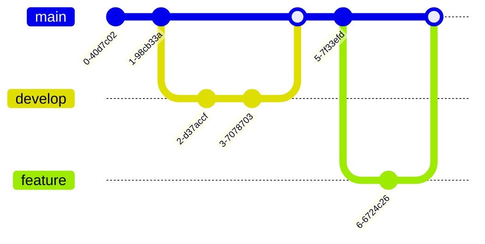

# markdown-preview.nvim


## Features Checklist

- [x] markdown render: markdown-it
- [x] markdown highlight
- [x] markdown css
- [x] math katex
- [x] plantuml
- [x] markdown-it option
- [x] katex option
- [x] plantuml option
- [x] markdown style option
- [x] highlight style option
- [x] sync scroll
- [x] preview page title
- [x] task list
- [x] emoji support
- [ ] cross platform test (mac/linux/windows)

---

# PlantUML

@startuml
Bob -> Alice : hello
Alice -> Bob : hi there
@enduml

---

# Flowchart.js

```flowchart
st=>start: Start|past:>http://www.google.com[blank]
e=>end: End|future:>http://www.google.com
op1=>operation: My Operation|past
op2=>operation: Stuff|current
sub1=>subroutine: My Subroutine|invalid
cond=>condition: Yes
or No?|approved:>http://www.google.com
c2=>condition: Good idea|rejected
io=>inputoutput: catch something...|future

st->op1(right)->cond
cond(yes, right)->c2
cond(no)->sub1(left)->op1
c2(yes)->io->e
c2(no)->op2->e
```

---

# Code Highlighting

```javascript
// Modern JavaScript example
const greet = (name) => `Hello, ${name}!`;

async function fetchData(url) {
  const response = await fetch(url);
  return response.json();
}

console.log(greet('World'));
```

```python
# Python example
def fibonacci(n: int) -> list[int]:
    """Generate Fibonacci sequence."""
    fib = [0, 1]
    for i in range(2, n):
        fib.append(fib[i-1] + fib[i-2])
    return fib[:n]

print(fibonacci(10))
```

```bash
#!/bin/bash
# Shell script example
for file in *.md; do
    echo "Processing: $file"
done
```

---

# KaTeX Math

## Inline Math

The quadratic formula is $x = \frac{-b \pm \sqrt{b^2-4ac}}{2a}$.

Einstein's famous equation: $E = mc^2$

## Block Math

$$
\int_{-\infty}^{\infty} e^{-x^2} dx = \sqrt{\pi}
$$

$$
\sum_{n=1}^{\infty} \frac{1}{n^2} = \frac{\pi^2}{6}
$$

## Maxwell's Equations

| Equation | Description |
|----------|-------------|
| $\nabla \cdot \vec{E} = \frac{\rho}{\varepsilon_0}$ | Gauss's law |
| $\nabla \cdot \vec{B} = 0$ | No magnetic monopoles |
| $\nabla \times \vec{E} = -\frac{\partial \vec{B}}{\partial t}$ | Faraday's law |
| $\nabla \times \vec{B} = \mu_0\vec{J} + \mu_0\varepsilon_0\frac{\partial \vec{E}}{\partial t}$ | Ampère's law |

## Matrix

$$
\begin{pmatrix}
a & b \\
c & d
\end{pmatrix}
\begin{pmatrix}
x \\
y
\end{pmatrix}
=
\begin{pmatrix}
ax + by \\
cx + dy
\end{pmatrix}
$$

---

# Chart.js

```chart
{
  "type": "pie",
  "data": {
    "labels": ["Red", "Blue", "Yellow"],
    "datasets": [{
      "data": [300, 50, 100],
      "backgroundColor": ["#FF6384", "#36A2EB", "#FFCE56"]
    }]
  }
}
```

---

# Mermaid Diagrams (v11)

## Flowchart


## Flowchart LR


## Sequence Diagram


## Class Diagram


## State Diagram


## Entity Relationship Diagram


## Gantt Chart


## Pie Chart


## Mindmap


## Timeline


## Quadrant Chart


## Git Graph



---

# Emoji Support

:smile: :heart: :thumbsup: :rocket: :fire: :star:

---

# Definition List

Term 1
:   Definition 1a
:   Definition 1b

Term 2
:   Definition 2

---

# Footnotes

Here is a footnote reference[^1], and another[^longnote].

[^1]: Here is the footnote content.

[^longnote]: Here's a longer footnote with multiple paragraphs.

    Subsequent paragraphs are indented.
